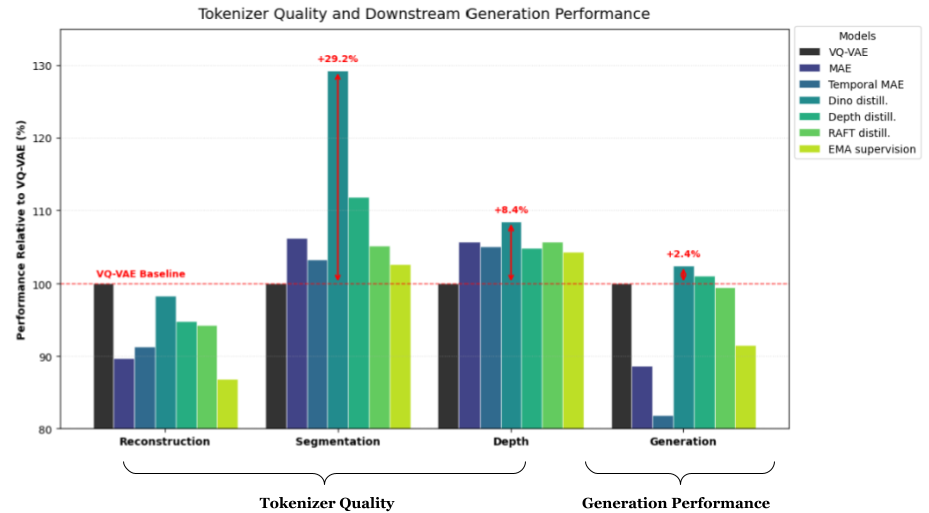
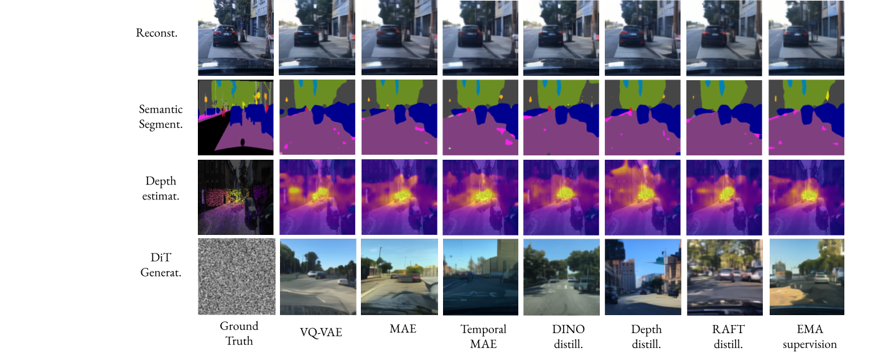

# Multilevel Representation Learning for DiT-based Image Generation

This repository hosts the code for a tokenizers that preserve both the semantic and perceptual information of the continuous latent tokens. The code includes the tokenizers like MAE, Temporal MAE, Temporal Compression, Auxiliary supervision using pretrained models (Dino, Depth, Raft, MIM), EMA-Stabilized Teacher supervision.

<table>
  <tr>
    <td align="center"></td>
    <td align="center"></td>
  </tr>
  <tr>
    <td align="center">Figure 1 : Performance of tokenizer across all 4 axes</td>
    <td align="center">Figuare 2 : Example Visuals for each tokenizer model</td>
  </tr>
</table>

## Contributions 

We implement various Self-supervised learning methods for designing a tokenizer that improves the semantic quality of tokens without significantly affecting the percetual qualtity, over a simple VQ-VAE baseline. The referenced tokenizers show improvement in the semantic and geometric quality of the tokens, while generation quality stays a bottleneck. 

Overall, from our experiments, self-supervised methods like Masking, Temporal context-based masking, Distillation from a strong pretrained priors, and EMA-stabilized teacher supervision can help maintain the balance between the semantic and perceptual objectives of a tokenizer. Dino distillation using auxiliary supervision like ours can maintain overall balance and improve the image generation quality.

## Checkpoints & Results

Results for Multilevel Representation Learning. Checkpoints are located in the `checkpoints/` folder.

| Model | rFID ↓ | gFID ↓ | mIoU ↑ | RMSE ↓ |
| :--- | :---: | :---: | :---: | :---: |
| VQ-VAE (Baseline) | 29.09 | 45.09 | 34.32 | 6.4156 | 
| MAE | 32.43 | 50.88 | 36.47 | 6.0660 |
| Temporal MAE | 31.86 | 55.10 | 35.46 | 6.1020 |  
| **Dino Distill.** | **29.60** | **44.03** | **44.34** | **5.9185** |
| Depth Distill. | 30.70 | 48.59 | 38.39 | 6.1160 |
| Raft Distill. | 30.87 | 46.66 | 36.10 | 6.0661 |
| EMA Supervision | 33.52 | 49.29 | 35.25 | 6.1494 |

> *Note: We report scores for our best configurations. Detailed discussion on mask ratios and architectural designs can be found in the attached report.*

## Requirements
A suitable python environment can be created and activated with:

```
conda env create -f environment.yaml
conda activate venv
```

### Training a tokenizer
```
python main.py --base configs/tokenizer.yaml -t True --n_gpus=4 --enable_codebook_usage_logger 
```
n_gpus: specifies number of gpus, default=1 \
n_nodes: specifies number of nodes, default=1 \

We have select the effective batch size of 128 for all our experiments.

### Fine-tune from previous checkpoint
```
python main.py --base configs/generation.yaml -t True --n_gpus=4 --enable_codebook_usage_logger 
```

### Evaluations

rFID :
```
python evaluate/compute_codebook_usage.py --config_path /work/dlclarge2/mutakeks-titok/Thesis/mae_orbis/baseline/config.yaml --ckpt_path /work/dlclarge2/mutakeks-titok/Thesis/mae_orbis/baseline/checkpoints/last.ckpt --compute_rFID_score
```

gFID :
```
python evaluate/compute_codebook_usage_dit.py --config_path /work/dlclarge2/mutakeks-titok/Thesis/mae_orbis/baseline/config.yaml --ckpt_path /work/dlclarge2/mutakeks-titok/Thesis/mae_orbis/baseline/checkpoints/last.ckpt --compute_rFID_score
```

Segmentation mIoU :
```
# python evaluate/segmentation.py --ckpt /work/dlclarge2/mutakeks-titok/Thesis/mae_orbis/baseline/checkpoints/last.ckpt --config /work/dlclarge2/mutakeks-titok/Thesis/mae_orbis/baseline/config.yaml --dump_vis True 
```

Depth RMSE :
```
# python evaluate/depth.py --ckpt /work/dlclarge2/mutakeks-titok/Thesis/mae_orbis/baseline/checkpoints/last.ckpt --config /work/dlclarge2/mutakeks-titok/Thesis/mae_orbis/baseline/config.yaml --split_dir evaluate/data --dump_vis True 
```
Note: For 2 frame setups (like Temporal MAE), '--num_input_frames' needs to be set manually to 2 for probe scripts. The code defauls to 1 input frame only.